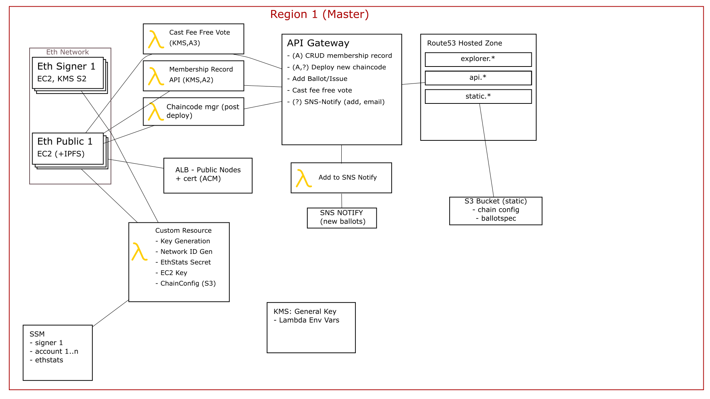

# Flux.Vote

**Now Finished** - video summary coming soon. A lot of good progress was made, though there were some setbacks. Broadly speaking the items remaining are API+Lambdas+UI (lambdas for stuff like fee-free voting).
This will hopefully be completed by the end of Jan 2019. Status updates will bbe posted here.

A two week code-binge to finish Flux's voting app (well, an alpha of it).

Goals:
* General Stack:
  * One-click deploy secure-ish voting stack on AWS (there are a few compromises made for pracitcal reasons, but realistically this is good enough for demo + proof of concept. There's lots more that can be done to improve things)
  * Usable by most* groups. [*]: Not governments, businesses, or those who aren't excellent to eachother. (That last one's a joke, but the first two aren't)
* Flux and other Good Things (tm)
  * Mirror Parliament (all bills in parliament replicated in the voting system with a live feed that auto-updates issues)
  * Petition type thing for referenda - user submitted
  * Auto email elected representatives before bills are voted on in APH letting them know how their jurisdiction voted (in our system)
  * Auto email elected representatives after bills are voted on in APH either patting them on the back or chastising them depending on whether they voted with their electorate or not
  * Allow Journos (etc) to subscribe to those emails too
  * Pretty graphics about the above

## Getting Involved

Want to help? Got some time between Jan 2nd and 6th? Great! For the moment read the goals and info on this site,
and have a look at the <a href="https://github.com/voteflux/flux-dot-vote/projects" target="_blank" rel="noopener noreferrer">projects on GitHub</a> where we're tracking tickets and ideas.
Also mention it in live chat!

## Livestream

The whole thing is livestreamed. Check it, yo:

    <iframe id="livestream-youtube" src="https://www.youtube.com/embed/live_stream?channel=UCzbr9m9G05Y5uy3HQuJWAlw" frameborder="0" allow="accelerometer; autoplay; encrypted-media; gyroscope; picture-in-picture" allowfullscreen></iframe>

## Schedule

1. 24th Dec
2. ~~25th Dec~~
3. 26th Dec
4. 27th Dec
5. 28th Dec
6. 29th Dec
7. 30th Dec
8. 31st Dec
9. 1st Jan
10. 2nd Jan
11. 3rd Jan
12. 4th Jan
13. 5th Jan
14. 6th Jan

## Architecture Diag (rough; WIP)

